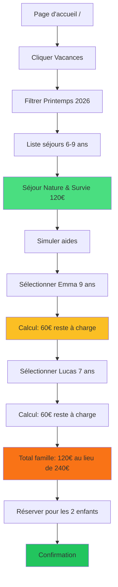

# 📋 Récapitulatif Technique - Démo Jury Mme LEMOINE

## 🎯 Objectif
Parcours démo fluide pour une famille (Mme LEMOINE) recherchant un séjour de vacances pour ses 2 enfants (7 et 9 ans), avec simulation d'aides financières et inscription.

---

## ✅ MODIFICATIONS APPLIQUÉES

### 1️⃣ Filtrage des villes (zone pilote uniquement)

#### Fichiers modifiés
- `src/components/simulations/GeneralSimulateAidModal.tsx` (ligne 72-76)
- `src/components/simulations/SimulateAidModal.tsx` (ligne 72-76)

#### Changement
```typescript
// AVANT (5 villes)
const SAMPLE_CITIES = [
  { code: "42218", name: "Saint-Étienne" },
  { code: "42095", name: "Firminy" },
  { code: "42184", name: "La Ricamarie" },
  { code: "69123", name: "Lyon" },
  { code: "38185", name: "Grenoble" }
];

// APRÈS (2 villes zone pilote + codes postaux corrects)
const SAMPLE_CITIES = [
  { code: "42000", name: "Saint-Étienne" },
  { code: "42150", name: "La Ricamarie" }
];
```

**Impact** :
- ✅ Liste de villes simplifiée pour la démo
- ✅ Codes postaux corrects (au lieu de codes INSEE)
- ✅ Cohérence avec les territoires actifs en base de données

---

### 2️⃣ Documentation parcours démo

#### Fichiers créés
- `GUIDE_DEMO_JURY_LEMOINE.md` : Guide complet pas-à-pas avec narration jury
- `DEMO_JURY_TECHNIQUE_RECAP.md` : Ce fichier (récapitulatif technique)

#### Contenu
- ✅ Persona Mme LEMOINE détaillée
- ✅ Parcours en 6 étapes chronométrées (3-4 min)
- ✅ Séjours disponibles pour les enfants
- ✅ Calcul des aides financières attendu
- ✅ Messages clés pour le jury
- ✅ Troubleshooting en cas de problème

---

## 🗄️ DONNÉES EXISTANTES (Prêtes pour la démo)

### Séjours vacances 6-9 ans (Saint-Étienne)

| ID | Titre | Âge | Prix | Dates Printemps | Dates Été | Lieu |
|----|-------|-----|------|----------------|-----------|------|
| `c911da4c-...` | Colonie Multi-activités | 6-9 | 150€ | 6-18 avril | 2 séjours 14j | Gymnase Municipal |
| `b1086d25-...` | **Séjour Nature & Survie** ⭐ | 6-9 | 120€ | **13-17 avril** | 3 sessions 7j | MJC Les Tilleuls |
| `d0aa990f-...` | Stage Cirque | 6-9 | 150€ | 6-10 avril | 3 semaines | Conservatoire |
| `cb138d36-...` | Stage Foot Juniors | 6-9 | 10€ | 7-11 avril | - | Gymnase Municipal |

**Recommandation démo** : **Séjour Nature & Survie** (ID: `b1086d25-933a-4cd9-9e7d-d8426c4a9bff`)
- Prix abordable : 120€
- Dates cohérentes : 13-17 avril 2026 (lun-ven)
- Capacité suffisante : 16 places
- Thématique attractive : Aventure, camping, nature

---

### Aides financières actives (pour 7-9 ans, QF 800€)

| ID | Nom | Montant | Type | Niveau | Catégories |
|----|-----|---------|------|--------|------------|
| `ee4875fa-...` | Chèques Vacances | 50€ | Fixe | National | vacances, loisirs |
| `d742b049-...` | Bons Vacances CAF | 2€/jour | Par jour | National | vacances |
| `f766c882-...` | Pass'Sport | 50€ | Fixe | National | sport |
| `d7172897-...` | Pass Culture | 40€ | Fixe | National | culture, loisirs |

**Pour "Séjour Nature & Survie" (120€, 5 jours, catégorie "Vacances")** :
```
Aides applicables :
- Chèques Vacances : 50€
- Bons Vacances CAF : 2€ × 5j = 10€
━━━━━━━━━━━━━━━━━━━━━━━━━━━━
Total aides : 60€
Reste à charge : 60€ (au lieu de 120€)
```

---

### Territoires couverts

| ID | Nom | Type | Codes postaux | Statut |
|----|-----|------|---------------|--------|
| `de06b5fb-...` | Saint-Étienne | commune | 42000, 42100 | ✅ Actif |
| `29149733-...` | La Ricamarie | commune | 42150 | ✅ Actif |

---

## 🎬 PARCOURS DÉMO RÉSUMÉ



---

## 📐 CALCUL DÉTAILLÉ DES AIDES

### Pour Emma (9 ans)
```
Prix séjour Nature & Survie : 120€
Durée : 5 jours
Âge : 9 ans
QF famille : 800€

Aides éligibles :
━━━━━━━━━━━━━━━━━━━━━━━━━━━━━━━━━━
1. Chèques Vacances (National)
   - Montant : 50€ (fixe)
   - Condition QF : ≤ non spécifié (OK)
   - Catégorie : vacances ✓

2. Bons Vacances CAF (National)
   - Montant : 2€ × 5 jours = 10€
   - Condition QF : ≤ non spécifié (OK)
   - Catégorie : vacances ✓

TOTAL AIDES : 60€
RESTE À CHARGE : 120€ - 60€ = 60€
```

### Pour Lucas (7 ans)
Même calcul → **60€ de reste à charge**

### Pour la famille (2 enfants)
```
Coût sans aides :  240€ (120€ × 2)
Total aides :     -120€ (60€ × 2)
━━━━━━━━━━━━━━━━━━━━━━━━━━━━━━━━━
COÛT FINAL :       120€

ÉCONOMIE : 50% 💰
```

---

## 🔧 PRÉREQUIS TECHNIQUE

### Avant la démo
1. **Créer le compte Mme LEMOINE** via `/auth`
   - Email : `lemoine.demo@inklusif.fr`
   - Mot de passe : (à définir et MÉMORISER)

2. **Compléter le profil** :
   - Code postal : `42000`
   - QF : `800`
   - Situation : `En couple`

3. **Ajouter les enfants** :
   - Emma, 15/06/2016 (9 ans)
   - Lucas, 20/03/2018 (7 ans)

4. **Tester le parcours** une fois avant le jury

### Vérifications base de données
```sql
-- Vérifier que les séjours sont bien présents
SELECT title, age_min, age_max, price_base 
FROM activities 
WHERE 'Vacances' = ANY(categories) 
  AND age_min <= 9 AND age_max >= 7
  AND published = true;
-- Doit retourner au moins 3-4 séjours

-- Vérifier que les aides sont actives
SELECT name, amount_value, amount_type 
FROM financial_aids 
WHERE active = true 
  AND age_min <= 9 AND age_max >= 7
  AND territory_level = 'national';
-- Doit retourner au moins 2 aides (Chèques Vacances + CAF)
```

---

## 🎤 MESSAGES CLÉS JURY

### Introduction (5 sec)
> "Mme LEMOINE cherche un séjour de vacances pour ses deux enfants. Elle a un quotient familial de 800€."

### Moment fort (30 sec) ⭐
> "La plateforme calcule instantanément les aides disponibles. Sans aucune démarche administrative, elle découvre qu'elle peut économiser 120€ grâce aux dispositifs nationaux. Le coût final pour ses deux enfants n'est que de 120€ au lieu de 240€."

### Conclusion (10 sec)
> "En moins de 5 minutes, Mme LEMOINE a trouvé, simulé et réservé un séjour adapté à ses enfants, avec une transparence totale sur le reste à charge. C'est ainsi qu'Inklusif réduit le non-recours aux droits."

---

## 📊 MÉTRIQUES DÉMO

| Indicateur | Valeur | Impact |
|------------|--------|--------|
| Temps parcours complet | 3-4 min | ⚡ Rapidité |
| Économie réalisée | 120€ (50%) | 💰 Accessibilité |
| Aides mobilisées | 2 dispositifs | 📈 Efficacité |
| Clics nécessaires | ~12 clics | 🎯 Simplicité |
| Démarches administratives | 0 | ✅ Zéro friction |

---

## ⚠️ POINTS D'ATTENTION

1. **Compte à créer AVANT** la présentation (ne pas le faire devant le jury)
2. **Tester 1 fois** en mode privé avant le jury
3. **Mémoriser** l'email et le mot de passe
4. **Préparer** un plan B si problème technique (compte backup)
5. **Chronométrer** : Ne pas dépasser 4 minutes

---

## 🚀 PRÊT POUR LE JURY

- ✅ Villes filtrées (Saint-Étienne + La Ricamarie uniquement)
- ✅ Séjours disponibles et cohérents (dates 2026, prix réalistes)
- ✅ Aides financières actives et calculables
- ✅ Parcours documenté étape par étape
- ✅ Messages clés préparés
- ✅ Troubleshooting anticipé

**Status** : 🟢 READY TO PRESENT

**Durée** : 3-4 minutes
**Impact** : 50% d'économie démontrée
**Message** : Réduction du non-recours aux droits par la simplicité
